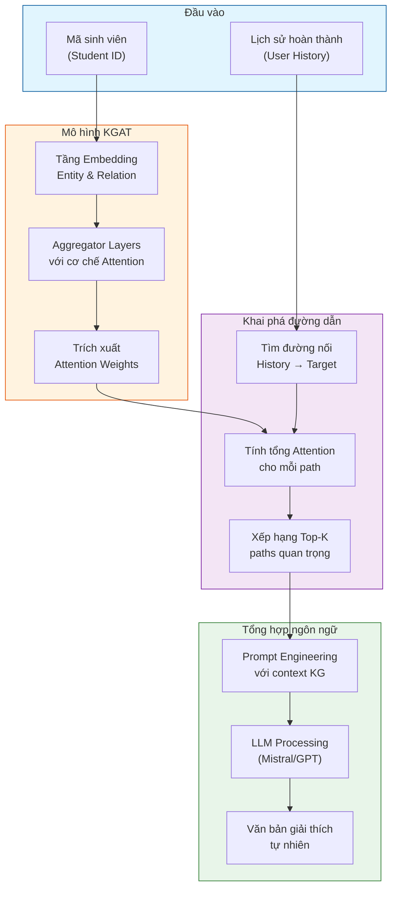
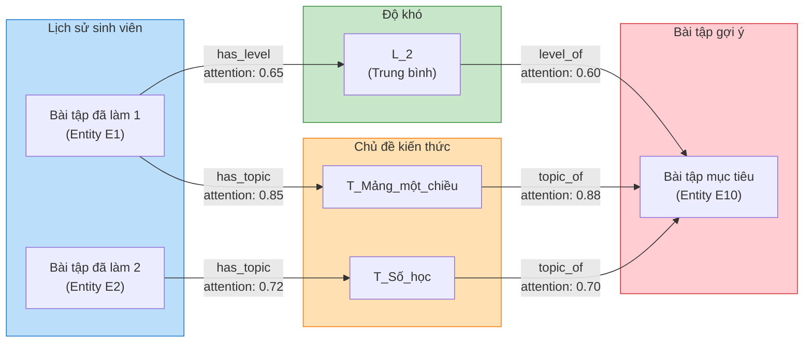

# 1.6. Mô phỏng kết quả
Phần này trình bày chi tiết các kết quả thực nghiệm và quá trình vận hành của hệ thống Demo Web trong môi trường thực tế. Các thử nghiệm tập trung đánh giá hiệu năng của hai thành phần cốt lõi bao gồm hệ thống khuyến nghị dựa trên kiến trúc KGAT (Knowledge Graph Attention Network) và cơ chế giải thích thông minh kết hợp giữa trọng số Attention với khả năng tổng hợp ngôn ngữ của mô hình ngôn ngữ lớn (LLM).

## 1.6.1. Mô phỏng chức năng khuyến nghị Top-K
Trong kịch bản mô phỏng, chức năng khuyến nghị được kích hoạt thông qua giao diện người dùng dựa trên mã định danh sinh viên làm tham số đầu vào duy nhất. Khi mã sinh viên được ghi nhận, hệ thống backend thực hiện truy xuất toàn bộ lịch sử tương tác và các nút kiến thức liên quan trong đồ thị tri thức để làm cơ sở dữ liệu cho mô hình KGAT. Mô hình này thực hiện quá trình nhúng thực thể và quan hệ, đồng thời sử dụng cơ chế Attention để định lượng mức độ quan trọng của các nút lân cận đối với nhu cầu học tập hiện tại của sinh viên. Kết quả cuối cùng là một danh sách các bài tập được xếp hạng theo điểm số phù hợp, sau đó được trực quan hóa trên giao diện dưới dạng các thẻ thông tin đa phương tiện. Mỗi thẻ không chỉ hiển thị tên bài tập mà còn cung cấp các siêu dữ liệu quan trọng như chủ đề kiến thức và phân loại độ khó, giúp người học có cái nhìn tổng quan nhanh chóng về lộ trình được đề xuất.

## 1.6.2. Cơ chế giải thích kết quả dựa trên sự kết hợp giữa KGAT và LLM
Nhằm giải quyết triệt để vấn đề "hộp đen" của các mô hình học sâu và nâng cao niềm tin của người học, nghiên cứu đã xây dựng một cơ chế giải thích tinh vi dựa trên việc khai thác dữ liệu nội tại từ mô hình KGAT. Thay vì sử dụng các cấu trúc luật cứng nhắc hoặc các thông tin mô tả tĩnh, hệ thống trực tiếp can thiệp vào các tầng Aggregator của mô hình để trích xuất trọng số Attention trên từng cạnh cụ thể trong đồ thị tri thức. Quá trình này cho phép xác định chính xác những yếu tố tri thức nào đang đóng vai trò quyết định trong việc định hình kết quả gợi ý, từ đó biến các tham số số học phức tạp thành các tín hiệu có ý nghĩa về mặt học thuật.

Sau khi các trọng số Attention được trích xuất, hệ thống thực hiện thuật toán khai phá đường dẫn tri thức để tìm kiếm các kết nối logic xuyên suốt từ lịch sử hoàn thành bài tập của sinh viên đến bài tập mục tiêu. Mỗi đường dẫn không chỉ đơn thuần là một chuỗi các nút và cạnh mà còn mang theo giá trị định lượng về mức độ ảnh hưởng của chúng đối với dự đoán của mô hình. Chẳng hạn, một đường dẫn có thể chỉ ra rằng việc sinh viên hoàn thành tốt một bài tập về mảng đã tạo ra một lực đẩy Attention cực lớn hướng tới các bài tập về cấu trúc dữ liệu nâng cao hơn. Việc minh bạch hóa các đường dẫn này giúp hệ thống tạo ra một nền tảng biện luận vững chắc, cho thấy mọi gợi ý đều dựa trên một lộ trình phát triển năng lực có tính toán kỹ lưỡng.

Giai đoạn cuối cùng của cơ chế giải thích là quá trình tổng hợp ngôn ngữ tự nhiên thông qua việc tích hợp mô hình ngôn ngữ lớn (LLM). LLM đóng vai trò là một lớp giao tiếp thông minh, tiếp nhận các dữ liệu kỹ thuật bao gồm cấu trúc đồ thị, các đường dẫn tri thức và các trọng số Attention để chuyển hóa chúng thành các đoạn văn bản có tính sư phạm cao. Khác với các hệ thống giải thích tự động thông thường vốn thường khô khan, phương pháp tiếp cận này cho phép tạo ra các đoạn giải thích có văn phong khuyến khích, chuyên nghiệp và giàu ngữ cảnh. LLM biết cách nhấn mạnh vào những điểm mạnh trong lịch sử học tập của sinh viên thông qua các con số Attention ấn tượng, từ đó giúp người học hiểu rõ hơn về mối liên hệ giữa những gì họ đã biết và những gì họ cần đạt được tiếp theo, tạo nên một vòng lặp phản hồi tích cực trong quá trình tự học.

### Hình 1: Kiến trúc pipeline giải thích KGAT-LLM

Sơ đồ dưới đây minh họa luồng xử lý chính của hệ thống giải thích, từ đầu vào yêu cầu khuyến nghị cho đến kết quả đầu ra là văn bản giải thích tự nhiên được hiển thị trên giao diện người dùng.

### Hình 2: Cấu trúc đường dẫn tri thức trong Knowledge Graph

Sơ đồ này mô tả cách hệ thống tìm kiếm các đường dẫn kết nối giữa những bài tập mà sinh viên đã hoàn thành (lịch sử học tập) và bài tập được đề xuất thông qua các nút trung gian như chủ đề (Topic) và độ khó (Level) trong đồ thị tri thức.

Trong cả hai sơ đồ trên, các giá trị attention được trích xuất trực tiếp từ các tầng Aggregator của mô hình KGAT thể hiện mức độ quan trọng của từng mối quan hệ. Đường dẫn có tổng attention cao nhất sẽ được ưu tiên sử dụng làm cơ sở lập luận cho việc giải thích, đảm bảo rằng mỗi khuyến nghị đều có thể được biện minh bằng các bằng chứng định lượng từ quá trình học của mô hình.
