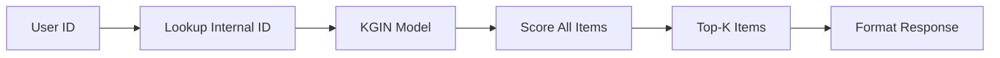
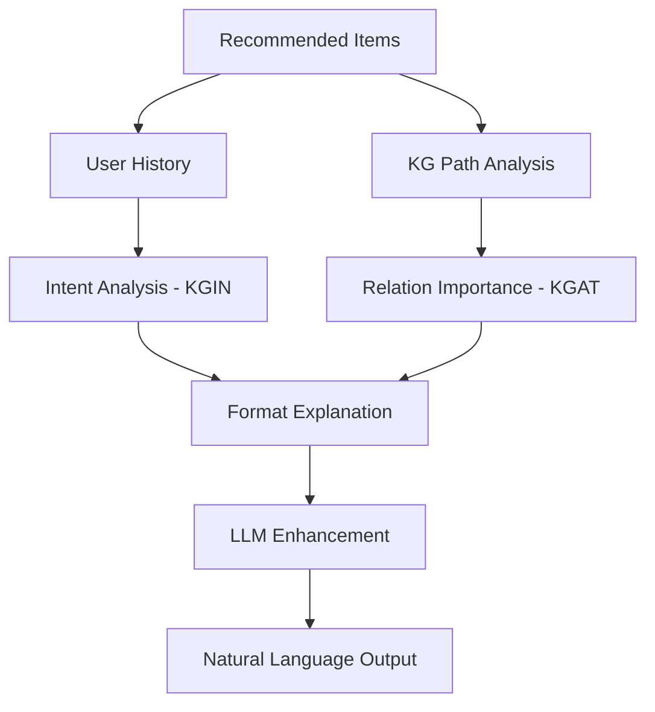

# Báo cáo Nghiên cứu: Hệ thống Gợi ý Dựa trên Đồ thị Tri thức với KGAT/KGIN

## Tóm tắt

Báo cáo này trình bày chi tiết về phương pháp xây dựng hệ thống gợi ý bài tập lập trình sử dụng các mô hình **KGAT (Knowledge Graph Attention Network)** và **KGIN (Knowledge Graph-based Intent Network)** từ thư viện RecBole. Hệ thống khai thác đồ thị tri thức (Knowledge Graph) để đưa ra gợi ý chính xác và có thể giải thích được.

---

## 1. Giới thiệu về Hệ thống Gợi ý Dựa trên Đồ thị Tri thức

### 1.1 Động lực

Các hệ thống gợi ý truyền thống (Collaborative Filtering) gặp phải vấn đề:
- **Cold-start**: Không hoạt động tốt với người dùng/sản phẩm mới
- **Data sparsity**: Ma trận tương tác thưa thớt
- **Interpretability**: Khó giải thích tại sao gợi ý

### 1.2 Giải pháp: Knowledge Graph

Đồ thị tri thức cung cấp:
- **Thông tin phụ trợ** về items (chủ đề, độ khó, liên kết)
- **Kết nối ngữ nghĩa** giữa các entities
- **Khả năng giải thích** thông qua paths trong graph

---

## 2. Mô hình KGAT (Knowledge Graph Attention Network)

### 2.1 Kiến trúc

KGAT xây dựng **Collaborative Knowledge Graph (CKG)** bằng cách kết hợp:
- **User-Item Interaction Graph**: Đồ thị tương tác người dùng
- **Knowledge Graph**: Đồ thị tri thức về items

```
CKG = User-Item Graph ∪ Knowledge Graph
```

### 2.2 Cơ chế Attention

KGAT sử dụng attention để tính trọng số cho từng neighbor khi aggregate:

```
α(h,r,t) = softmax(π(h,r,t))
π(h,r,t) = (W_r · e_t)^T · tanh(W_r · e_h + e_r)
```

Trong đó:
- `e_h, e_t`: Embeddings của head và tail entities
- `e_r`: Embedding của relation
- `W_r`: Ma trận trọng số
- `α`: Attention weight

### 2.3 Ứng dụng trong Giải thích

Attention weights cho phép:
- Xác định **relations quan trọng nhất** cho recommendation
- Truy vết **paths có trọng số cao** từ user đến item
- Tạo giải thích như: "Bài này được gợi ý vì quan hệ chủ đề có trọng số 85%"

---

## 3. Mô hình KGIN (Knowledge Graph-based Intent Network)

### 3.1 Khái niệm User Intent

KGIN mô hình hóa **user intent** (ý định người dùng) như tổ hợp có trọng số của các KG relations:

```
Intent_i = Σ_r (w_r · e_r)
```

### 3.2 Relational Path Aggregation

KGIN tích hợp thông tin từ các relational paths:

```
e_u^(l+1) = Σ_i (β_i · Agg(N_i(u)))
```

Với `β_i` là trọng số của intent thứ i.

### 3.3 Ứng dụng trong Giải thích

KGIN cung cấp:
- **Intent Analysis**: Phân tích xu hướng học của sinh viên
- **Intent Matching**: Giải thích item phù hợp với intent nào
- Ví dụ: "Dựa trên lịch sử, bạn có xu hướng học về Số học (70%) và Level 1 (85%)"

---

## 4. Cấu trúc Dataset

### 4.1 File cpp.kg (Knowledge Graph)

```
head_id:token    relation_id:token    tail_id:token
E1               has_topic            T_Kiểu_dữ_liệu_Viết_vòng_lặp_Viết_hàm
E1               has_level            L_1
```

**Relations trong hệ thống:**
| Relation | Ý nghĩa | Ví dụ |
|----------|---------|-------|
| `has_topic` | Bài tập thuộc chủ đề | E1 → T_Số_học |
| `topic_of` | Chủ đề chứa bài tập | T_Số_học → E1 |
| `has_level` | Bài tập có độ khó | E22 → L_1 |
| `level_of` | Độ khó áp dụng cho bài | L_1 → E22 |

### 4.2 File cpp.link (Entity Mapping)

Ánh xạ giữa Item ID và Entity ID:
```
item_id:token    entity_id:token
1                E1
22               E22
```

### 4.3 File cpp.item (Item Metadata)

```
item_id    question_id    name              group           type      level
22         CPP0130        ƯỚC SỐ NGUYÊN TỐ  LẬP TRÌNH C++   T_Số_học  L_1
```

---

## 5. Cách Tạo Gợi ý

### 5.1 Pipeline Tổng quan



### 5.2 Chi tiết Kỹ thuật

1. **Input Processing**
   ```python
   user_inter = Interaction({uid_field: torch.tensor([user_id])})
   ```

2. **Score Prediction**
   ```python
   scores = model.full_sort_predict(user_inter.to(device))
   ```

3. **Top-K Selection**
   ```python
   topk_scores, topk_iids = torch.topk(scores, k)
   ```

---

## 6. Cách Xây dựng Giải thích

### 6.1 Luồng Tạo Giải thích



### 6.2 Phân tích KG Paths

Tìm đường đi từ user history đến recommended item:

```
History Item → has_topic → Topic → topic_of → Recommended Item
```

Ví dụ:
```
TÍNH TỔNG 1 ĐẾN N → has_topic → Số học → topic_of → ƯỚC SỐ NGUYÊN TỐ
```

### 6.3 Tính Relation Importance (KGAT-style)

```python
def calculate_relation_importance(item_id, user_history):
    # Đếm matching topics từ history
    matching_score = count_matching_topics(item_id, user_history)
    
    # Normalize theo history length
    importance = matching_score / len(user_history)
    
    return {
        'relation': 'has_topic',
        'importance': importance,
        'reason': 'Phù hợp với xu hướng học'
    }
```

### 6.4 Phân tích User Intent (KGIN-style)

```python
def analyze_user_intents(user_history):
    # Đếm topics và levels từ history
    topic_counts = Counter([get_topic(item) for item in history])
    level_counts = Counter([get_level(item) for item in history])
    
    # Intent chính = topic xuất hiện nhiều nhất
    primary_intent = {
        'type': 'topic_focus',
        'value': topic_counts.most_common(1)[0],
        'strength': count / len(history)
    }
    
    return {'intents': [primary_intent, ...]}
```

### 6.5 Tích hợp LLM

Sau khi có KG context, sử dụng LLM để tạo giải thích tự nhiên:

```python
prompt = f"""
Bạn là giáo viên lập trình. Giải thích gợi ý:

Thông tin KG:
{kg_context}

Phân tích Intent:
{intent_analysis}

Viết giải thích ngắn gọn bằng tiếng Việt.
"""
```

---

## 7. Triển khai Kỹ thuật

### 7.1 Cấu trúc Module

```
apps/backend/
├── enhanced_kg_explainer.py   # KGAT/KGIN explainer mới
├── kg_explainer.py            # KG path analysis
├── kg_based_explainer.py      # Markdown generation
├── llm_explainer.py           # LLM integration
├── attention_extractor.py     # Attention weights extraction
└── routers/
    └── recommendations.py     # API endpoints
```

### 7.2 API Endpoints

**GET /recommendations/{student_id}/explained**

Response:
```json
{
  "student_id": 123,
  "recommendations": [
    {
      "external_id": "22",
      "score": 0.95,
      "info": {"title": "ƯỚC SỐ NGUYÊN TỐ", "topic": "Số học"},
      "kg_explanation": {
        "head_id": "E22",
        "metadata": {"topic": "T_Số_học", "level": "L_1"},
        "kg_context_text": "**Chủ đề**: Số học\n**Độ khó**: Level 1..."
      }
    }
  ]
}
```

### 7.3 Frontend Display

Component `RecommendationCard.jsx` hiển thị:
- Thông tin cơ bản (title, topic, level)
- Expandable "Tại sao gợi ý bài này?" section
- KG paths visualization
- KGAT/KGIN analysis

---

## 8. Kết luận

Hệ thống gợi ý sử dụng KGAT/KGIN từ RecBole cung cấp:

1. **Gợi ý chính xác** nhờ khai thác quan hệ trong KG
2. **Giải thích minh bạch** thông qua:
   - Attention-weighted paths (KGAT)
   - User intent analysis (KGIN)
   - Relation importance scoring
3. **Trải nghiệm tự nhiên** với LLM-enhanced explanations

---

## Tài liệu Tham khảo

1. Wang, X., et al. (2019). KGAT: Knowledge Graph Attention Network for Recommendation. KDD.
2. Wang, X., et al. (2021). Learning Intents behind Interactions with Knowledge Graph for Recommendation. WWW.
3. RecBole Documentation: https://recbole.io/
4. RecBole-KG: https://github.com/RUCAIBox/RecBole-KG
